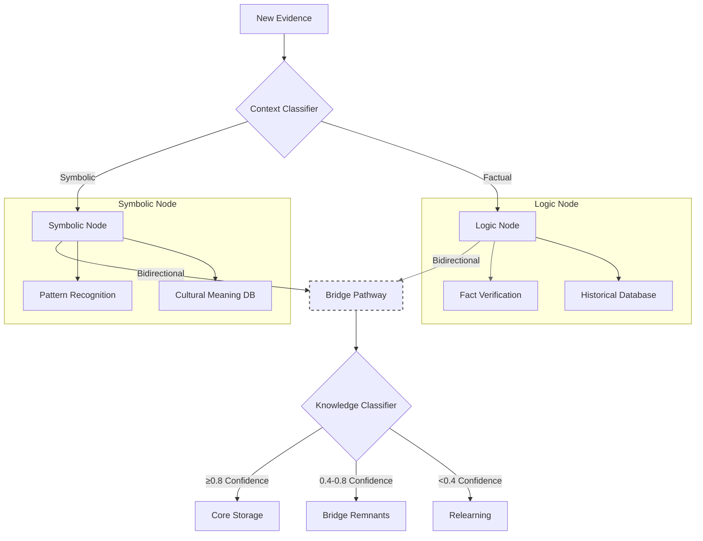

## How AI Knowledge Classification Works

Let's break down how the AI would "know" where information belongs (Logic, Symbolic, or a Bridge trail) and how the "lighter" bridge data works.

### 1. How Each Node Stores Individually (Recap & Reinforcement):

#### Logic Node (vector_memory.json):

- **Content**: Stores chunks of text that are primarily factual, descriptive, or denotative.
- **Mechanism**: When DynamicBridge routes a chunk deemed "factual" (based on detect_content_type or other heuristics we'll discuss), the LogicNode's store_memory (which calls store_vector from vector_memory.py) creates a vector embedding of the text.
- **Metadata is Key**: Stores the text, its vector, source URL, learning_phase it's most relevant to for storage, source_trust, exploration_depth ("deep" or "shallow"), and a confidence_score (e.g., higher if from a trusted source or if it aligns strongly with existing factual clusters).
- **Example**: "The Python programming language was created by Guido van Rossum and first released in 1991." -> Stored in Logic Node, likely with high confidence, learning_phase could be 1 (if encountered then) or 3 (if encountered when focusing on history).

#### Symbolic Node (symbol_memory.json, symbol_occurrence_log.json, symbol_emotion_map.json):

- **symbol_memory.json**: Stores definitions of symbols (seed, emergent, meta). Each symbol has keywords, core meanings (often denotative initially), an evolving emotion_profile, example contexts (vector_examples), origin, learning_phase of origin/update, and resonance_weight.
- **symbol_occurrence_log.json**: Logs every instance a known symbol is detected in processed text, along with the surrounding text, detected emotions in that specific context, source, learning phase of occurrence, and relevance. This is raw data for analysis.
- **symbol_emotion_map.json**: Aggregates the emotional weight for each symbol across all its occurrences, providing a general "emotional signature."
- **Mechanism**: When DynamicBridge routes a chunk, the SymbolicNode's process_input_for_symbols uses parser.py to find known symbols. If found, their occurrence is logged, their entry in symbol_memory.json might be updated (e.g., new example context, emotion profile tweaked), and symbol_emotion_map.json is updated. If relevant new symbols emerge (via symbol_generator.py or symbol_suggester.py), they're added to symbol_memory.json.
- **Example**: If "slay" is defined in symbol_memory.json with a symbolic meaning of "excel," and the input "She slayed the runway" is processed:
  - Its occurrence is logged in symbol_occurrence_log.json with detected emotions (e.g., admiration).
  - The "slay" entry in symbol_memory.json might get this runway example added to its vector_examples.
  - symbol_emotion_map.json updates "slay"'s admiration score.

### 2. How It Knows to Connect Its Clusters (Implicitly and Explicitly):

- **Implicit Connections** (via Vector Similarity):
  - Within the LogicNode, texts about similar factual topics will naturally have similar vector embeddings and thus "cluster" implicitly. When you retrieve_similar_vectors, these are the connections being leveraged.
  - Within the SymbolicNode, symbols with similar vector_examples or overlapping keywords/emotional profiles will also be implicitly related.
- **Explicit Connections** (The Bridge's Role): This is where your "trails" come in. The bridge doesn't store full content but rather relationships between content in the Logic and Symbolic nodes, or between different interpretations of the same term.

### 3. How Data Stays in the Bridge and How It's "Lighter":

The "Bridge" isn't a primary storage location for new raw content in the same way the Logic/Symbolic nodes are. Instead, it stores metadata about relationships, ambiguities, and evolving interpretations.

#### Bridge Storage (Conceptual File: bridge_connections.json or similar):
- **Content**: It wouldn't store lengthy text chunks. It would store:
  - **Links between Nodes**: 
    ```json
    {
      "type": "logic_to_symbolic", 
      "logic_id": "fact_xyz_id", 
      "symbolic_id": "symbol_abc_id", 
      "context": "Hinduism", 
      "strength": 0.85, 
      "reason": "Co-occurrence in religious texts"
    }
    ```
  - **Etymology Trails** (as discussed):
    ```json
    {
      "term": "slay",
      "trail_id": "slay_trail_1",
      "pathway": [
        {"node_type": "logic", "meaning_id": "slay_oe_kill", "period": "Old English", "confidence": 0.95},
        {"node_type": "symbolic", "meaning_id": "slay_ballroom_excel", "period": "1970s Ballroom", "confidence": 0.8}
      ],
      "overall_trail_confidence": 0.75,
      "supporting_evidence_keys": ["source_id_1", "source_id_2"]
    }
    ```
  - **Ambiguity Records / "Bridge Remnants"**: For when a piece of text has moderate confidence for both logical and symbolic interpretation, or low confidence for either. This is where your "0.4 <= x < 0.8" confidence idea fits.
    ```json
    {
      "ambiguity_id": "amb_slay_performance_123",
      "term_in_question": "slay",
      "source_text_preview": "The performer slayed the audience...",
      "source_url": "...",
      "logic_interpretation_confidence": 0.3, // Too low for Logic Node solo
      "symbolic_interpretation_confidence": 0.7, // Too low for Symbolic Node solo (initially)
      "dominant_leaning": "symbolic",
      "contextual_cues": ["performer", "audience"],
      "status": "pending_further_evidence_or_reflection"
    }
    ```

#### Lighter Nature:
- **References, Not Copies**: Primarily stores IDs/pointers to full records in Logic/Symbolic nodes.
- **Metadata-Focused**: Stores relationship types, confidence scores for the relationship itself, contextual triggers, keywords that signify the ambiguity or connection.
- **No Deep Vectors of its Own**: It doesn't need to generate its own high-dimensional vectors for the connections; it uses the vectors from the nodes it's linking.

### 4. How It "Knows" to Keep Bridge Data Lighter (Logic/Symbolism > Unknown):

This is enforced by the processing pipeline and confidence thresholds defined in your DynamicBridge and KnowledgeClassifier (as conceptualized in our previous discussion based on DeepSeek's input).

#### Initial Classification: 
When new content (a chunk from web_parser) comes to the DynamicBridge:
- **detect_content_type(chunk_text)**: This function (you'll build it, drawing on ideas from my previous response about factual vs. symbolic markers) makes an initial assessment:
  - Is this overwhelmingly factual (many citations, dates, technical terms, neutral language)? -> High factual confidence.
  - Is this overwhelmingly symbolic/metaphorical (uses "symbolizes," "represents," rich in emotional language, poetic structure)? -> High symbolic confidence.
  - Does it have elements of both, or is it unclear? -> Moderate/low confidence for both, or high for one and moderate for another.
- **Confidence Scores**: The system assigns confidence scores (e.g., logic_conf, symbolic_conf).

#### Storage Decision (KnowledgeClassifier logic):
- **High Confidence** (e.g., >= 0.8) for one type and low for the other:
  - If logic_conf >= 0.8 AND symbolic_conf < 0.4: Store fully in LogicNode.
  - If symbolic_conf >= 0.8 AND logic_conf < 0.4: Store fully in SymbolicNode.
- **Moderate Confidence / Ambiguity** (e.g., both scores between 0.4 and 0.8, or one high and one moderate):
  - This is where the Bridge comes into play. The raw chunk might still be stored in the "dominant" node (e.g., if symbolic_conf = 0.7 and logic_conf = 0.3, it leans symbolic).
  - Crucially, an Ambiguity Record or a new Connection Trail is created/updated in the Bridge's storage. This record notes:
    - The term/concept in question.
    - Pointers to the (potential) entries in Logic/Symbolic nodes.
    - The confidence scores for each interpretation.
    - The contextual cues that made it ambiguous.
  - This Bridge entry is "light" – it's metadata about the ambiguity.
- **Low Confidence for Both** (e.g., < 0.4):
  - The content might be flagged for a "relearning queue" or stored as a very low-confidence "bridge remnant" indicating high uncertainty. It's "unknown" and needs more evidence.

#### Natural Emergence from Web Scraping (Your 90-95% Logic First):
- **Phase 1** (Computational Identity - mostly factual):
  - The AI scrapes Wikipedia pages on algorithms, computer architecture, etc.
  - detect_content_type will predominantly classify this as "factual."
  - LogicNode gets populated with high-confidence entries.
  - If it encounters a phrase like "the 'soul' of the machine" in a philosophical aside on a tech page:
    - detect_content_type might flag this as more symbolic or ambiguous.
    - KnowledgeClassifier might give it moderate symbolic confidence and low logical confidence for that specific phrase.
    - This phrase might be stored as a low-confidence symbolic snippet or a "bridge remnant" noting its unusual context. The main factual content of the page still goes to Logic.
- **Later Phases** (More Symbolic Content):
  - When the AI scrapes philosophy, literature, or cultural discussions (Phases 2, 3, 4), detect_content_type will more often flag content as "symbolic."
  - SymbolicNode gets populated.
  - If it encounters "algorithm" used metaphorically in a philosophical text:
    - LogicNode already has a strong factual definition from Phase 1.
    - SymbolicNode might create a new entry for "algorithm (metaphorical)."
    - A Bridge Trail would be created linking LogicNode.algorithm(definition) to SymbolicNode.algorithm(metaphorical), noting the contextual shift.

In essence, the "knowing" comes from:

1. **Intrinsic Signals in Text**: Factual language patterns differ from symbolic/metaphorical ones. Your detect_content_type function learns to spot these.
2. **Confidence Scoring**: Quantifying the certainty of the classification.
3. **Pre-defined Thresholds**: Your rules for what confidence level routes data where (Logic, Symbolic, Bridge, Relearn).
4. **Curriculum Priming**: Starting with mostly factual content helps the AI build a strong baseline for what "logical" means, making it easier to identify deviations that are symbolic or ambiguous.

The bridge remains "lighter" because it's not trying to be a primary repository of all knowledge. It's a specialized system for managing relationships, contested meanings, evolutionary pathways, and the gray areas between the more clearly defined knowledge in the Logic and Symbolic nodes. The nodes always hold the bulk of the detailed content because high-confidence, clearly classifiable information naturally goes directly to them.


----

Okay, considering all the Python scripts and the current state of your JSON data files, here's what I believe is the most logical and impactful next step:

**Next Best Step: Robust Implementation & Testing of `autonomous_learner.py` with Full Phase-Aware Link Evaluation and Data Storage.**

You've built an incredibly comprehensive set of tools and foundational structures. The `autonomous_learner.py` is where it all comes together to actually *run* the learning process. The immediate priority is to ensure this script can effectively:

1.  **Scrape content according to the current phase.**
2.  **Evaluate extracted links based on current phase relevance** (and future phase potential).
3.  **Defer or shallow-dive non-current-phase links** intelligently.
4.  **Route processed chunks (from main pages and shallow dives) to the `DynamicBridge` with the correct `target_storage_phase` and other metadata (like `is_shallow_content`, `is_highly_relevant_for_current_phase`).**
5.  **Ensure the `DynamicBridge` correctly instructs the `LogicNode` and `SymbolicNode` to store information tagged with the appropriate `learning_phase` (which should be the `target_storage_phase`) and other relevant flags (like `exploration_depth`).**

**Why this is the most critical next step:**

* **Core Learning Loop:** This is the heart of your AI's ability to learn and grow autonomously through your curriculum. Without this working smoothly, the AI won't populate its `vector_memory.json`, `symbol_occurrence_log.json`, `symbol_memory.json`, etc., in a phase-appropriate way.
* **Phase Adherence Validation:** This is your main current challenge ("low recognition of relative words," sticking to the 4 steps). Getting this right is paramount.
* **Data Generation for Analysis:** A successful run of `autonomous_learner.py` (even just through Phase 1 and part of Phase 2 initially) will generate the rich data in your JSON files that all your analysis scripts (`symbol_drift_plot.py`, `trail_graph.py`, clustering scripts, etc.) depend on.
* **Foundation for SPO-B Testing:** Once the AI has learned phase-appropriate symbolic and factual knowledge, you can then introduce high-density symbolic inputs through your `main.py` (interactive mode) to test for Symbolic Processing Overload.

**Specific Actions to Take:**

1.  **Refine `autonomous_learner.py` Link Evaluation Logic:**
    * Implement the `score_text_against_phase_keywords` function as discussed, using `primary`, `secondary`, and `anti_keywords` from your `CurriculumManager`.
    * Implement the `evaluate_link` function to decide "FOLLOW_NOW", "DEFER_SHALLOW", "DEFER_URL_ONLY", or "IGNORE".
    * Ensure the main loop in `autonomous_learner.py` correctly uses these functions to manage its scraping queue and the `deferred_urls_by_phase` dictionary.
    * Make sure `web_parser.py` has a robust `extract_links_with_text_from_html` function (using BeautifulSoup is recommended for this over regex for HTML).

2.  **Enhance `DynamicBridge.route_chunk_for_processing`:**
    * Modify its signature to accept `target_storage_phase` and `is_shallow_content` (defaulting to `False`).
    * When it calls `logic_node.store_memory` or interacts with `SymbolicNode` for storage purposes, it should pass `target_storage_phase` as the `learning_phase` argument to those node methods.
    * It should also pass along information about whether the content was from a shallow dive, so this can be stored as `exploration_depth: "shallow"` in `vector_memory.json`.

3.  **Update Node Storage Methods:**
    * Ensure `LogicNode.store_memory` (which uses `vector_memory.store_vector`) correctly receives and stores `target_storage_phase` as `learning_phase` and adds an `exploration_depth` field to the `vector_memory.json` record.
    * Similarly, ensure `SymbolicNode.process_input_for_symbols` (and its underlying calls to `SM_SymbolMemory.add_symbol`, `UM_UserMemory.add_user_memory_entry`) correctly tags stored symbol definitions or occurrences with the `target_storage_phase` as their `learning_phase`.

4.  **Develop `detect_content_type(text_chunk)` function:**
    * This function, likely used by the `DynamicBridge` or even earlier by `autonomous_learner.py` before routing, is crucial for deciding if a chunk leans factual or symbolic, and assigning initial confidence.
    * Start with heuristic-based rules (presence of factual markers vs. symbolic markers, as discussed). This doesn't need to be perfect initially but should give a reasonable first pass.

5.  **Initial Test Run (Phase 1 Focus):**
    * Clear out your `data/*.json` files (or back them up and use fresh ones).
    * Configure `autonomous_learner.py` to run for a limited number of URLs or a limited time, primarily focusing on Phase 1 sources.
    * **Observe Closely:**
        * Print statements are your friend! Log which URLs are being followed, deferred, or ignored, and *why* (which keywords matched/missed, what the scores were).
        * Check `deferred_urls_log.json` to see if links are being correctly tabled for future phases.
        * Inspect `vector_memory.json`: Are entries tagged with the correct `learning_phase` (should be mostly 1, but some might be `target_storage_phase` 2, 3, or 4 with `exploration_depth: "shallow"`)?
        * Inspect `symbol_occurrence_log.json` and `symbol_memory.json`: Is Phase 1 symbolic content being captured correctly?

**Why not other things first?**

* **Detailed Bridge Logic (Debate, etc.):** While fascinating, this requires rich, nuanced data to be meaningful. The AI needs to *have* conflicting information or etymological trails before it can debate them. This data comes from successful `autonomous_learner` runs.
* **Sophisticated Response Generation (`main.py`):** Again, better responses will come when the AI has more knowledge. Right now, `main.py` is a good tool for direct data injection and testing specific interactions. Unifying it with `DynamicBridge` is a good idea but secondary to getting the autonomous learning right.
* **Advanced Clustering/Visualization:** These tools will be much more insightful when you have more data generated by the learner.

By focusing on making `autonomous_learner.py` truly phase-aware and correctly store data with the right phase tags, you'll build the foundation upon which all the more advanced analysis and behaviors will rest. This addresses your primary concern about the AI sticking to its curriculum and not getting lost.
